De rien à un filtre FM pour SWL
===============================

[](https://aisler.net/p/new?url=https://raw.githubusercontent.com/loic-fejoz/learning-kicad-fm-swl-filter/main/fm-filter.kicad_pcb&ref=github)

# Objectifs

> "Dans un voyage ce n'est pas la destination qui compte mais toujours le chemin parcouru, et les détours surtout."  
> — <cite>Philippe Pollet-Villard</cite>


Vous avez acheté une clef SDR ? Moi aussi. Vous avez commencé à faire un peu d'écoute. Peut-être avez-vous fabriqué votre propre antenne aussi ? Viens alors l'idée de passer à la vitesse supérieure et fabriquer vos propres circuits comme un transceiver par exemple, ou un LNA ou...

Mais ces circuits sont déjà d'un niveau supérieur. J'ai donc voulu expérimenter la création d'une carte plus simple depuis sa conception, son analyse, jusqu'à son expérimentation. Or les ondes de station FM se superposent souvent au signal que l'on veut écouter diminuant par la même la dynamique que l'on perçoit. Dés lors le voyage dans la création d'un **filtre passe-haut** peut commencer ...avec ses détours!

NB&nbsp;: vous l'aurez compris, je suis un [n00b](https://fr.wikipedia.org/wiki/Newbie).

Autres projets similaires dans l'esprit :

* [Filtre coupe-bande FM 88 à 108MHz, de la conception à la réalisation](https://www.f4iha.fr/2021/10/16/filtre-coupe-bande-fm-88-a-108mhz-de-la-conception-a-la-realisation/)

# Conception

Bien évidemment un filtre coupe-bande FM serait probablement plus approprié, surtout s'il est bien net. Mais je voulais quelque chose d'encore plus simple. Retrouvons nous donc sur https://rf-tools.com/lc-filter/ pour concevoir ce filtre de Chebyshev d'ordre 5 avec pour fréquence de coupure 120MHz. Les impédances d'entrée et de sortie seront bien entendus de 50Ω comme l'antene et la clef SDR. 

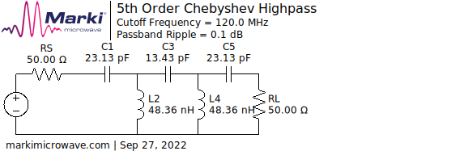

Au final, ce sera donc 3 condensateurs, 2 inductances, et bien sûr 2 connecteurs SMA. Au passage, rf-tools.com peut aussi fournir des valeurs standardisées mais nous n'allons pas utiliser cette fonctionalité qui sera l'occasion d'un détour.

# Schématique KiCad

Il est donc temps maintenant de passer sous KiCad pour éditer la schématique du projet. Cette étape est relativement aisée et il n'y a pas besoin de faire appel à des librairies externes.

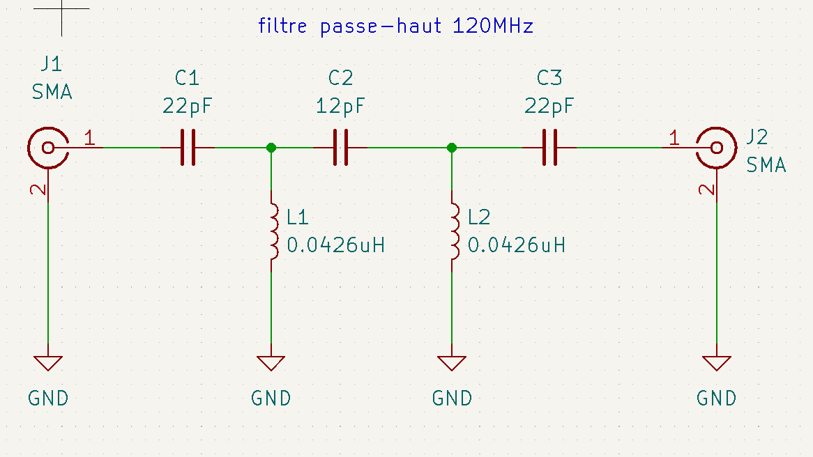

Au passage, le connecteur SMA est un connecteur coaxial générique et "SMA" n'est que le label :

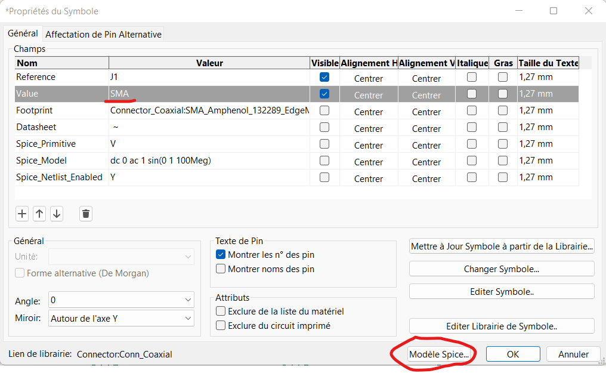

Comme on peut le voir dans la boite de dialogue ci-dessus, on peut définir un modèle spice. Or Spice, c'est pour de la simulation. Directement dans KiCad, il est en effet possible d'[inspecter par simulation le circuit](https://www.kicad.org/discover/spice/). Dans notre cas, il faut donc remplacer J2 par une simple résistance :

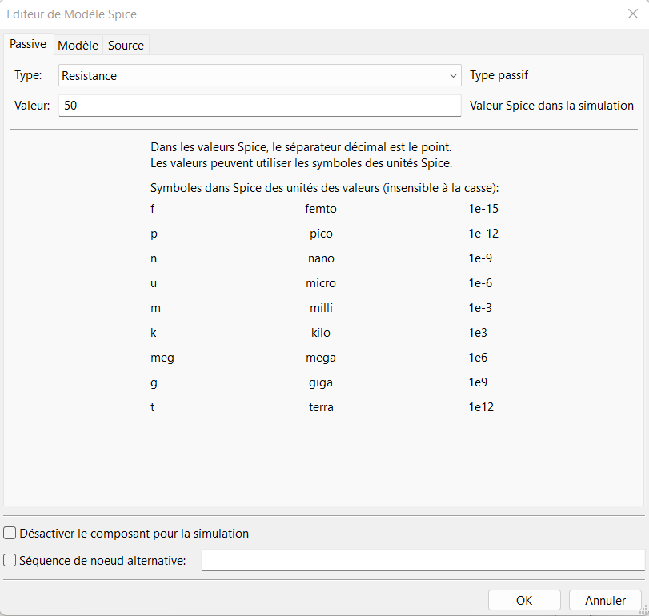

J1 devrait être remplacée par une source alternative en série avec une résistance de 50Ω. Mais là, rien de vraiment simple dans cette boite de dialogue. Enfin si, on pourrait utiliser un modèle externe. C'est-à-dire créé un fichier `.lib` qui décrirait cette source alternative et la résistance en série. Mais il apparait alors plus simple de rajouter dans le schéma les élements de simulation :

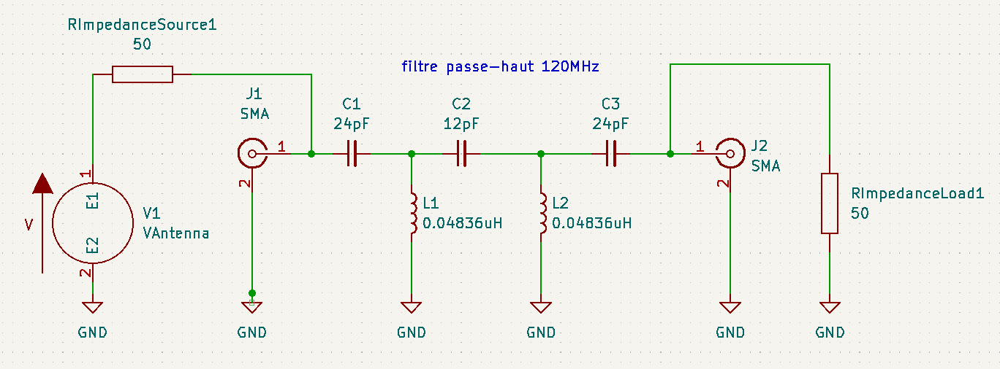

Il y a même une catégorie de composants "pspice". Par contre, il faut tout de même indiquer qu'ils ne font pas partie véritablement de la liste du matériel ainsi que du circuit imprimé.

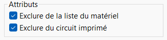

Enfin, concernant la source de tension, il faudra la configurer en source alternative d'amplitude 1. La fréquence n'aura pas de conséquence vu les analyses que l'on fera.

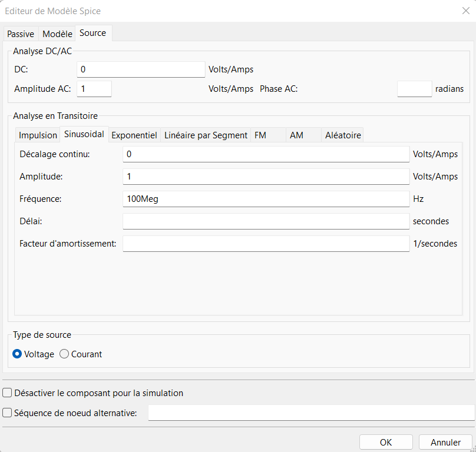

# Simulation Spice dans KiCad

Il est temps de lancer la simulation via le menu `Inspecter > Simulateur...` ce qui ouvrira la fenêtre dédiée. Le bouton `Paramètres Sim` ouvrira la boîte de dialogue suivante :

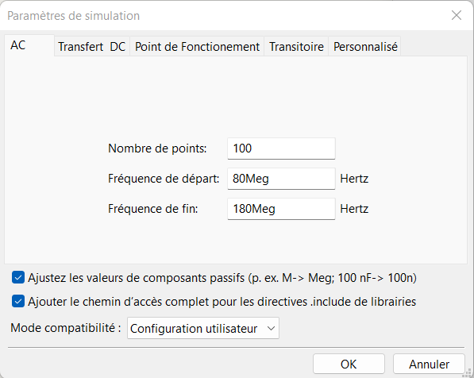

Une fois l'analyse désirée indiqué, à savoir analyser la réponse en fréquence sur la place 80MHz-180MHz par exemple, puis avoir lancer la simulation, on peut alors utiliser le bouton `Sonde` pour aller choisir *sur le schéma* le point de sortie du filtre. On voit alors apparaître la réponse de notre filtre :

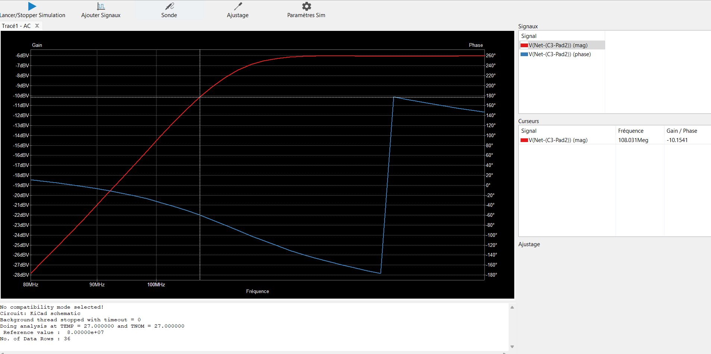

On retrouve bien la courbe caractéristique d'un filtre passe-haut. Mais nous avions laissé de côté la valeur des composants à réellement utiliser et si vous avez bien observé, les valeurs sont même différentes dans mes différentes captures d'écran. Il est donc temps de comprendre l'impact de ces valeurs. On peut tester l'impact en restant dans KiCad avec le bouton `Ajustage` puis en sélectionnant un composant. Mais J'aimerais une visualisation plus systématique...

# Simulation LTSpice

Il existe plusieurs simulateurs Spice et KiCad permet facilement d'exporter notre schéma dans ce format via le menu `Exporter > Netliste... > Spice`.

[LTSpice](https://www.analog.com/en/design-center/design-tools-and-calculators/ltspice-simulator.html) est un de ces simulateurs qui peut donc analyser ce circuit. Il suffit de rajouter la ligne suivante dans le fichier (avant le `.end`) pour lancer la même analyse:

```spice
.ac LIN 100 88Meg 180Meg
```

Bien évidement, nous retrouvons alors le même résultat que directement dans KiCad. Mais Spice permet bien plus. Nous pouvons notamment définir des variables globales et demander au simulateur de lancer plusieurs simulations. Par exemple, on peut évaluer une liste précise de valeurs comme suit :

```spice
...
L1 Net-_C1-Pad2_ GND {L}
...
.step param L LIST 40nH 41nH 0.0426uH 45nH 48nH
```

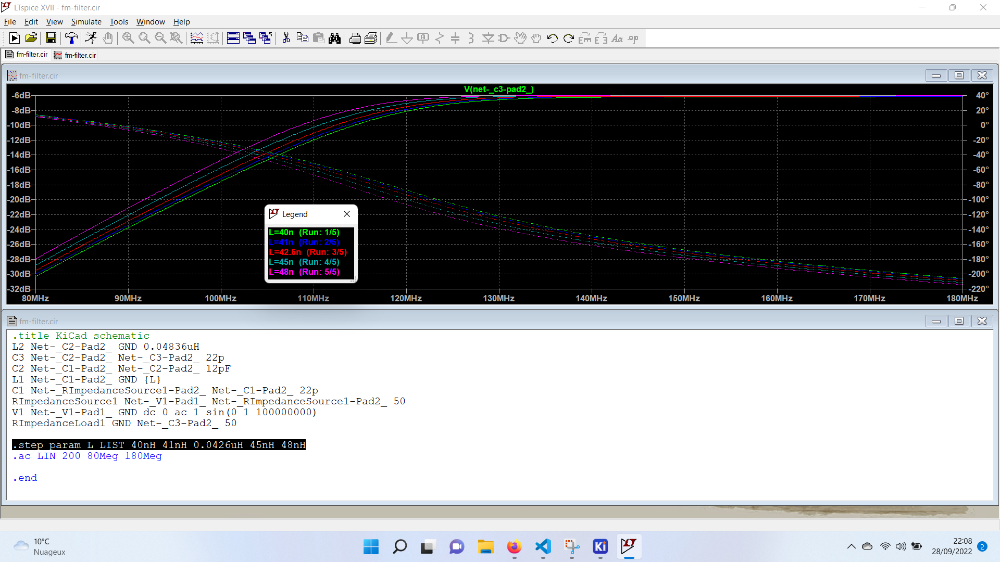

Ou bien encore définir une borne haute, et basse, ainsi que l'incrément

```
...
C2 Net-_C1-Pad2_ Net-_C2-Pad2_ {C2}
...
.step param C2 10p 14p 2p
```

Après avoir un peu joué avec les analyses, et sachant que je compte faire l'inductance à la main, je cherche à choisir les valeurs des condensateurs parmi la série E24(±5%).

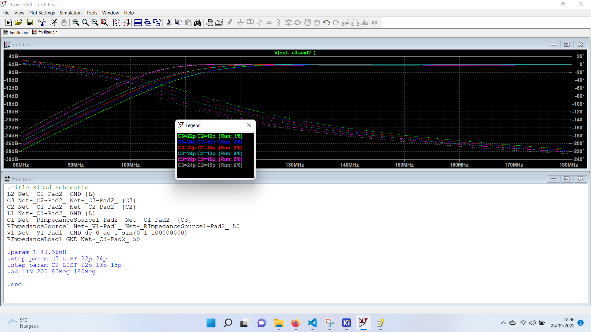

Cela m'amène à choisir les valeurs de 12pF et 22pF respectivement. Et pour comprendre quelle est la précision attendue dans la réalisation de l'impédance, je simule encore la variation de l'inductance.

NB: une `*` en début de ligne passe celle-ci en commentaire.

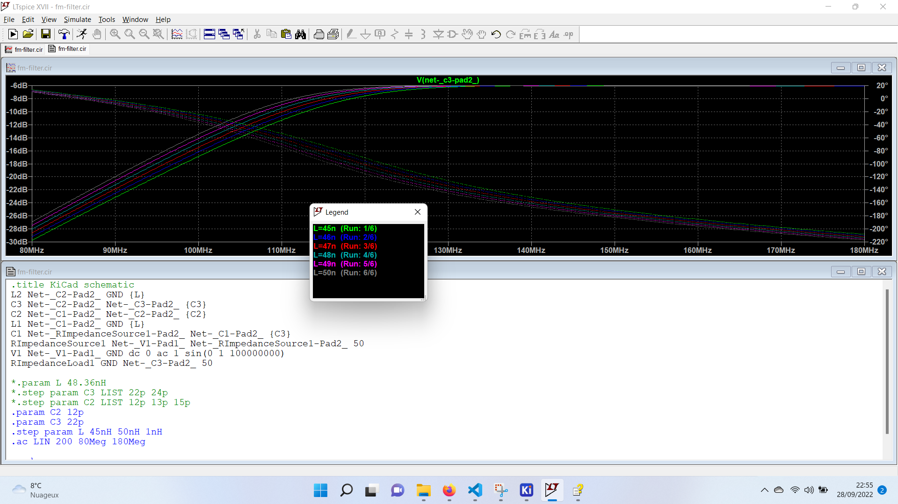

Il faudra effectivement viser entre 47nH et 48nH.

# KiCad PCB

Retour dans KiCad pour lancer l'outil d'affectation d'empreinte afin de pouvoir commencer la création du PCB. Comme j'envisage d'utiliser le filtre pour du SWL, je n'ai pas de problème de puissance, et je choisi donc des condensateurs SMD en taille 0805.

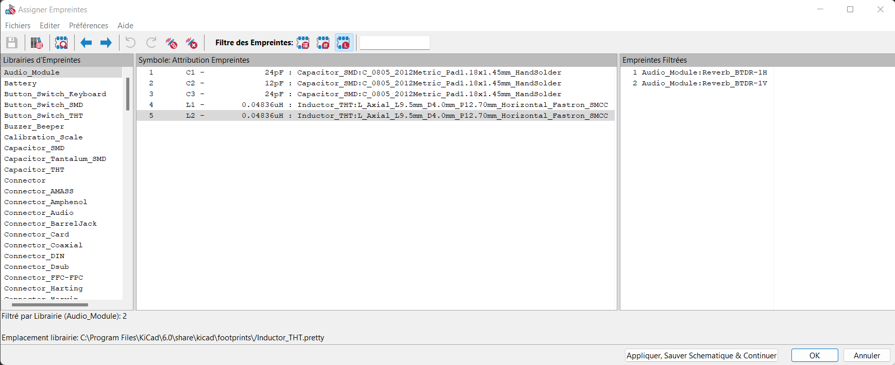

Pour les inductances, il faudrait savoir quelle taille pourrait faire une bobines à air faite à la main. L'utilitaire mini Tore Calculateur peut être d'une grande utilité pour cela. Pour simplifier, j'ai cherché un nombre entier de tours et des valeurs réalisables :

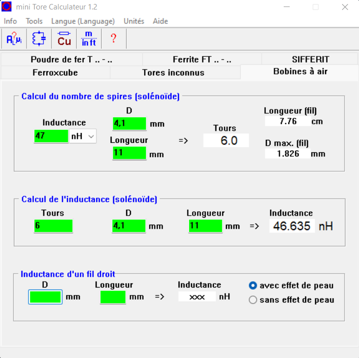

Et j'ai pu trouver des empreintes d'inductances déjà existances avec de telles dimensions, ce qui renforce la confiance dans le réalisme espéré.

Nous avons donc maintenant une idée de la taille des composants. Nous savons aussi qu'il nous faudra utiliser un PCB double faces pour avoir un bon plan de masse et utiliser plein de vias. Mais comment choisir la taille des pistes&nbsp;? En fait, cela va dépendre des caractéristiques du support PCB utilisé, en particulier l'épaisseur du substrat et des couches. Heureusement, KiCad possède un outil de calcul. En supposant que l'on désire une impédance d'entrée (resp. de sortie) de 50&ohm; et que l'on désire un PCB de 1,6mm d'épaisseur hors-tout, et d'une couche de cuivre de 1 oz (35&micro;m), nous pouvons synthétiser alors les résultats suivant&nbsp;:

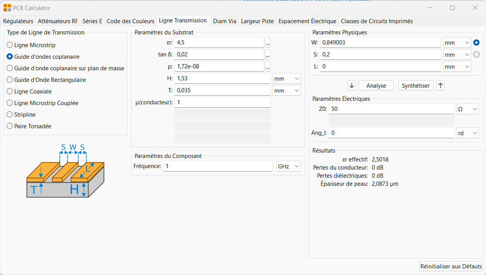
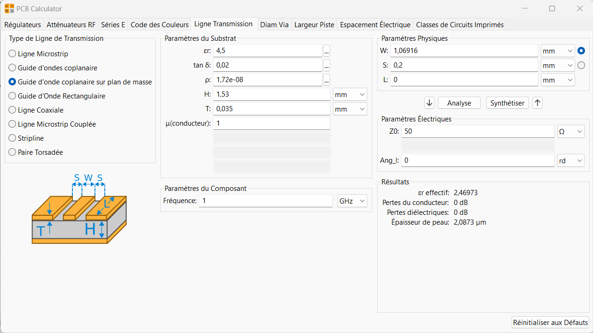

Nous pouvons alors rajouter cette contrainte (0,85mm ou 1,069mm selon le type de PCB) dans les règles de conception comme ceci&nbsp;:

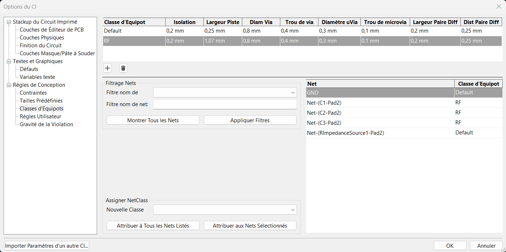

NB&nbsp;: Bien sûr l'impact sera anectodique sur ce circuit en particulier, mais autant prendre de bons réflexes.

A ce stade, nous avons quelques choses comme cela&nbsp;:

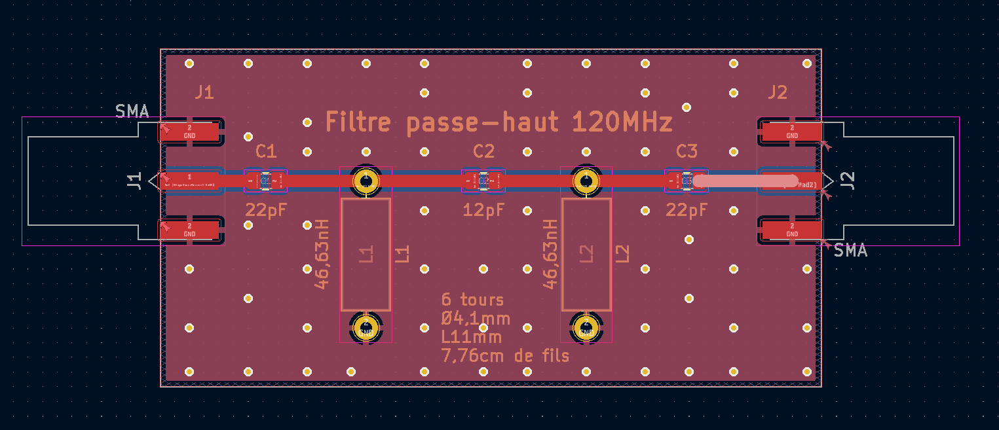
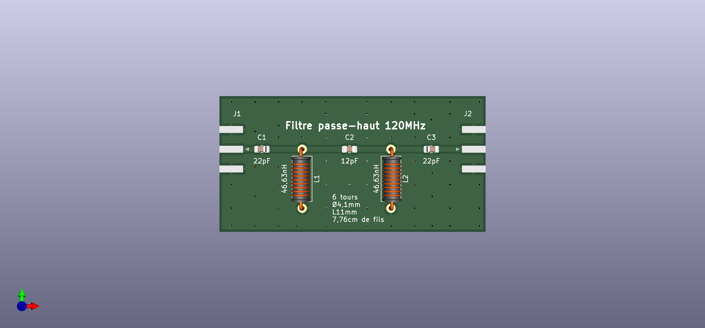

Il nous faut maintenant passer à la réalisation...

# Réalisation

## à la mano

C'est parti pour une première réalisation "à la main" du circuit. Comme on peut le voir sur la photo suivante je n'ai pas eu le courage de faire autant de vias que prévu. 😬

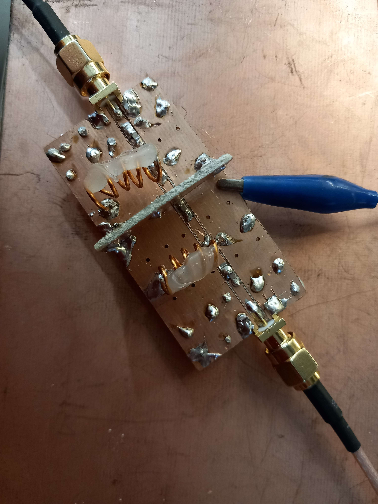

Et maintenant place aux mesures ! La pince crocodile bleue sert de mise à la masse du plan de masse en dessous pour ne pas être perturbé par un effet capacitif. Plutôt concluant et correct, non ?

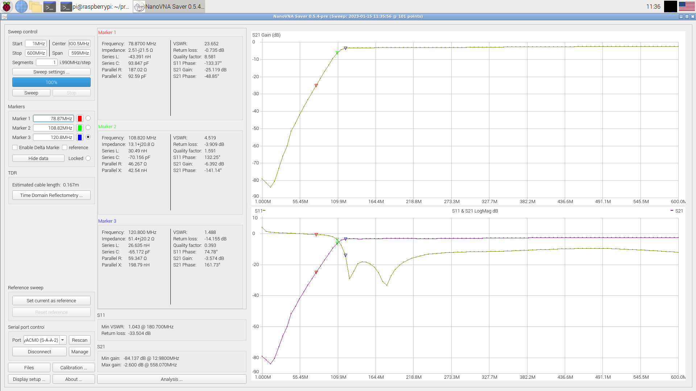


## 1ére commande en ligne

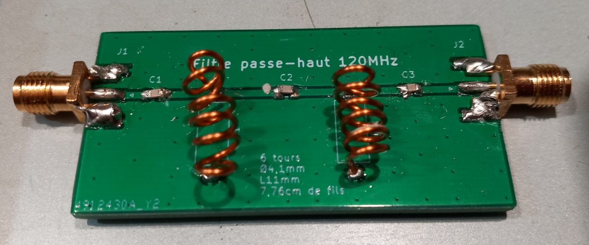

Même principe mais avec un PCB fabriqué par [JLCPCB](https://jlcpcb.com/).
Encore une fois les inductances ont été réalisées à la main autour d'un forêt de ⌀4mm. Mais voyez-vous le problème venir ? Sur cette réalisation, il n'y a pas de séparation de découplage des 2 inductances. Du coup, le filtre ne fonctionne pas du tout comme prévu évidement. L'effet est beaucoup plus notable que ce à quoi je m'attendais.

Deux solutions possibles :

1. on remet une séparation.
2. on place les inductances à 90° pour réduire l'effet.

Pour un premier PCB, c'est à la fois simple mais instructif ! Essayons de faire mieux maintenant.

## 2ème commande en ligne

Outre le problème de couplage des inductances, l'empreinte du connecteur SMA n'était pas le bon car trop espacée. Enfin, il n'y avait rien de prévu pour la fixation de la carte en elle-même.

Donc après de nombreuses recherches, dans l'éditeur de PCB, on peut rajouter des empreintes d'un _mounting hole_ pour le support de la carte. La difficulté réside dans l'étape fastidieuse de changer le mode de _connexion des pads_ en _solide_. A l'inverse, les trous de support de la cloison sont aussi des _Pin_D1.0mm_L10.0mm_LooseFit_ mais avec un mode de _connexion des pads_ de type _frein thermique_ afin de faciliter le soudage.

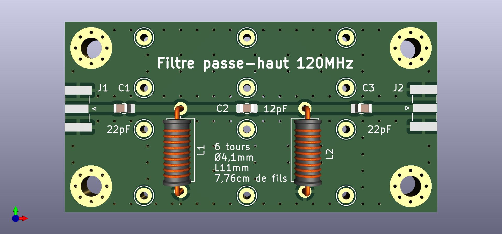

TODO: commander et mesurer!

## La suite

Une de mes prochaines lectures sera [CEM - Parasites et perturbations des électroniques, Alain Charoy](https://www.dunod.com/sciences-techniques/cem-parasites-et-perturbations-electroniques-tome-1) alors qui sait ce que je vais découvrir... Peut-être un meilleur placement des vias ?

[](https://www.dunod.com/sciences-techniques/cem-parasites-et-perturbations-electroniques-tome-1)

# Remerciements

Merci à tous les radio-amateurs et électroniciens publiants leurs expériences, les youtubeurs pour leurs tutoriels, et les membres du Discord "Radio-Actifs"&nbsp;!

# Bibliographie


* https://alicja.space/blog/designing-lna-with-bandpass-filter
* https://wiki.electrolab.fr/Projets:Perso:2012:Upconverter
* https://rf-tools.com/lc-filter/
* Discord "Radio-Actifs"
* [Youtube KiCad Controlled Impedance Traces (e.g. 50Ω) - Phil's Lab #3](https://www.youtube.com/watch?v=0fteCxn5XXA)
* [Youtube  Top 5 Beginner PCB Design Mistakes (and how to fix them) ](https://www.youtube.com/watch?v=D0X76Kbf8fQ)
* [Youtube  PCB Vias 101 - Phil's Lab #77](https://www.youtube.com/watch?v=WPT96w3eLAM)
* [Youtube  KICAD Prise en mains et premier PCB de A à Z ](https://www.youtube.com/watch?v=dAck3bxzehA)
* [Design a 50 ohm impedance microstrip line for RF signals](https://www.disk91.com/2015/technology/hardware/design-a-50ohm-impedance-net-for-rf-signals/)
* [Calcul et applications des lignes microstrip. - Joël Redoutey - F6CSX](http://f6csx.free.fr/techni/LIGNES%20MICROSTRIP.pdf)
* [PCB pour les n00bs - F6ITU](https://cdn.discordapp.com/attachments/702414448945659945/710137281130004520/PCB_pour_les_n00bs.docx)


# Licence

Ce texte est sous [licence Creative Commons Attribution - Partage dans les Mêmes Conditions 4.0 International (CC BY-SA 4.0)](LICENSE.md)